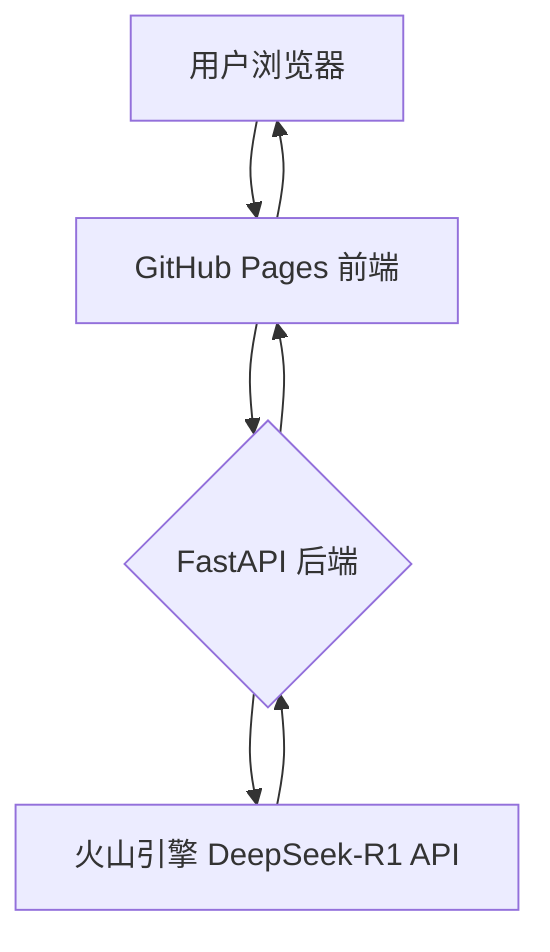

# AI/LLM 作品集

## 技术能力

- **前端开发**: 熟练掌握 React/Vue/Next.js，精通HTML/CSS及响应式设计。
- **UI/UX**: 注重简洁高效的用户体验设计，优化信息架构与移动端适配。
- **AI/后端**: 具备 LLM 应用开发与 API 集成经验（火山DeepSeek, OpenAI, Claude），熟练运用 FastAPI 构建稳定后端服务。

---

## 案例: AI 学术润色系统

> 基于火山引擎 DeepSeek-R1 的专业文本润色、AI检测和风格转换服务。

### 📋 项目概述

为解决学生与研究人员使用 AI 写作时的查重顾虑，本项目提供专业的 AI 文本润色、检测及风格转换服务。

**[➡️ 立即访问网站](https://ktwu01.github.io/1AI-polish)**

### 🎯 核心功能

- **多风格润色**: 学术、正式、通俗、创意
- **AI 内容检测**: 精准分析 AI 生成概率
- **LLM 深度推理展示**: 透明化呈现 DeepSeek-R1 思考过程
- **实时服务统计**: 关键指标（处理时间, AI 概率）一目了然

### 🏗️ 系统架构

**部署架构**:
- **前端**: GitHub Pages 静态托管
- **后端**: FastAPI + Celery + Redis，支持本地或 Render 云端部署
- **AI 服务**: 火山引擎 DeepSeek-R1 API

**核心算法**:
- **文本生成**: 集成 OpenAI GPT-4, Claude, GLM
- **AI 检测**: 采用 GPTZero, OpenAI Detect 及自研 RoBERTa/BERT 模型
- **改写降重**: 融合句法分析与 Embedding 相似度控制
- **数据安全**: 支持本地运行模式，云端数据定时清理，保障合规

---

## 动态项目列表

- [查看我的所有 HTML 项目](https://github.com/ktwu01?tab=repositories&language=html)
- [查看我的所有 React 项目](https://github.com/ktwu01?tab=repositories&q=topic%3Areact)
- [查看我的所有 Vue.js 项目](https://github.com/ktwu01?tab=repositories&q=topic%3Avuejs)
- [查看我的所有 Next.js 项目](https://github.com/ktwu01?tab=repositories&q=topic%3Anextjs)
- [查看我的所有 LLM 项目](https://github.com/ktwu01?tab=repositories&q=topic%3Allm)

*最后更新: 2025年7月*