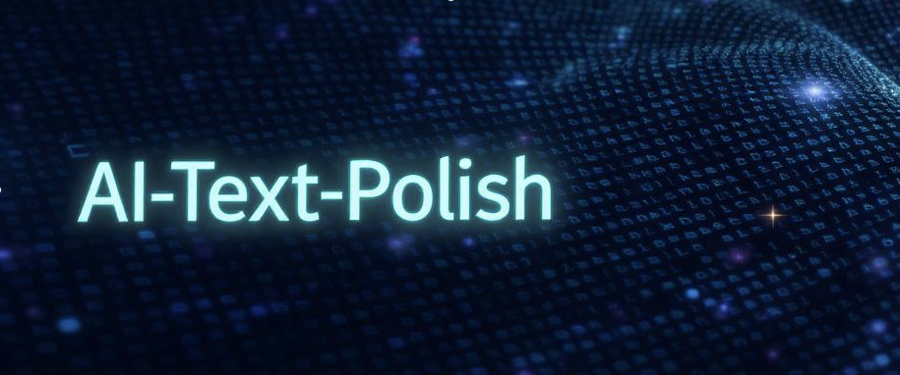
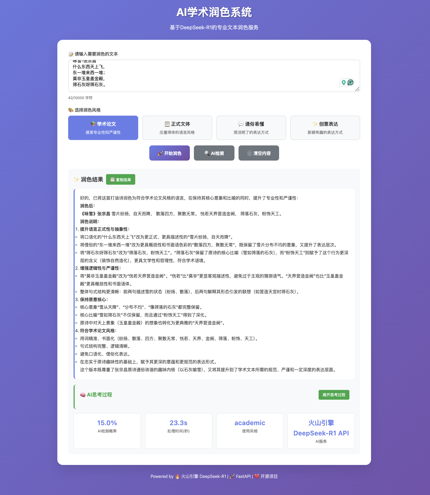
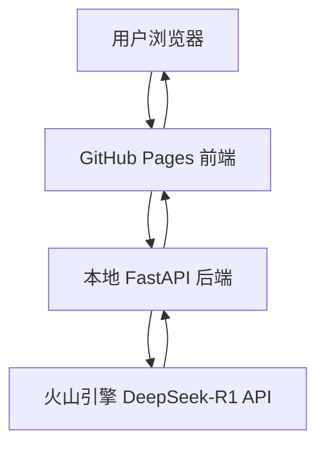

# 我的 AI-LLM 作品集 - AI Agent 开发

## 技术能力

**前端开发**: 熟练掌握 现代化React/Vue/Next.js, 传统 HTML/CSS 响应式设计

**用户体验**: ？？？设计美学，  信息架构优化，移动端适配

**AI经验**: ？？？？？

## 案例

### AI学术润色系统

> 基于火山引擎 DeepSeek-R1 的专业文本润色、AI检测和风格转换服务

## 📋 项目概述

本项目为学生和研究人员提供AI文本润色服务，解决使用AI写作但担心AI查重的矛盾需求。

### **[立即访问网站：](https://ktwu01.github.io/1AI-polish)**

使用示例：

### 🎯 核心功能
- **🎨 多风格润色**：学术论文、正式文体、通俗易懂、创意表达
- **🔍 AI检测分析**：检测文本的AI生成概率并提供详细分析
- **🧠 思考过程展示**：显示DeepSeek-R1的深度推理过程
- **📊 实时统计**：处理时间、AI概率、使用的服务等指标

### 🏗️ 系统架构

**混合部署架构**：
- **前端**：本地部署/GitHub Pages 前端静态托管。
- **后端**：本地部署/Render 后端部署模块。FastAPI 服务 + Celery异步任务 + Redis缓存。
- **AI服务**：火山引擎 DeepSeek-R1 API
- [] **算法模块**：
	- [] 文本生成：OpenAI GPT-4 / Claude / GLM
	- [] AI检测：GPTZero、OpenAI Detect、自己训练的RoBERTa/BERT模型
	- [] 改写降重：结合句法改写 + Embedding相似度控制（Contrastive Tuning）
	- [] 数据安全合规：本地运行选项 / 云端临时缓存自动删除

**动态项目列表**:
- [查看我的所有HTML项目](https://github.com/ktwu01?tab=repositories&language=html)
- [查看我的所有React项目](https://github.com/ktwu01?tab=repositories&q=topic%3Areact&type=&language=&sort=)
- [查看我的所有Vue.js项目](https://github.com/ktwu01?tab=repositories&q=topic%3Avuejs&type=&language=&sort=)
- [查看我的所有Next.js项目](https://github.com/ktwu01?tab=repositories&q=topic%3Anextjs&type=&language=&sort=)
- [查看我的所有LLM项目](https://github.com/ktwu01?tab=repositories&q=topic%3Allm&type=&language=&sort=)

https://github.com/ktwu01?tab=repositories&q=topic%3ALLM&type=&language=&sort=

*最后更新: 2025年7月*