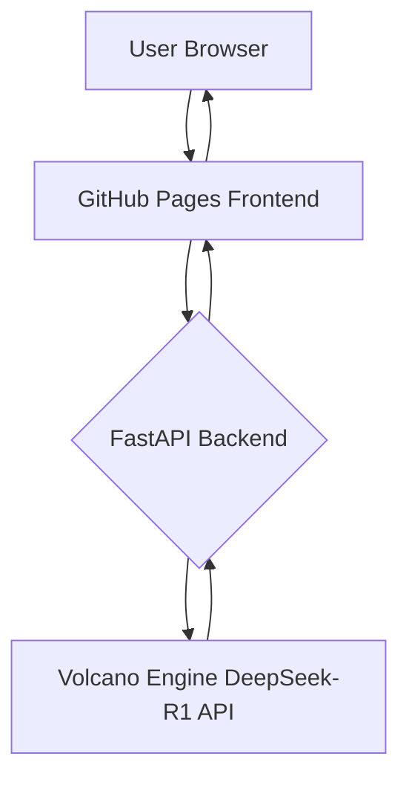

# AI/LLM Portfolio

## Technical Skills

- **Frontend Development**: Proficient in modern React/Vue/Next.js, and traditional HTML/CSS responsive design.
- **UI/UX**: Focus on concise and efficient user experience design, optimizing information architecture and mobile adaptation.
- **AI/Backend**: Experienced in LLM application development and API integration (Volcano DeepSeek, OpenAI, Claude), skilled in building stable backend services with FastAPI.

---

## Case Study: AI Academic Polishing System

> Professional text polishing, AI detection, and style conversion service based on Volcano Engine DeepSeek-R1.

### 📋 Project Overview

To address the concerns of students and researchers using AI for writing while worrying about AI plagiarism detection, this project provides professional AI text polishing, detection, and style conversion services.

**[➡️ Visit Website Now](https://ktwu01.github.io/1AI-polish)**

### 🎯 Core Features

- **Multi-style Polishing**: Academic, Formal, Popular, Creative
- **AI Content Detection**: Accurate analysis of AI generation probability
- **LLM Deep Reasoning Display**: Transparent presentation of DeepSeek-R1's thought process
- **Real-time Service Statistics**: Key metrics (processing time, AI probability) at a glance

### 🏗️ System Architecture

**Deployment Architecture**:
- **Frontend**: GitHub Pages static hosting
- **Backend**: FastAPI + Celery + Redis, supporting local or Render cloud deployment
- **AI Service**: Volcano Engine DeepSeek-R1 API

**Core Algorithms**:
- **Text Generation**: Integrated OpenAI GPT-4, Claude, GLM
- **AI Detection**: Utilizes GPTZero, OpenAI Detect, and self-developed RoBERTa/BERT models
- **Rewriting for Plagiarism Reduction**: Combines syntactic rewriting with Embedding similarity control
- **Data Security**: Supports local operation mode, timed cleanup of cloud data to ensure compliance

---

## Dynamic Project List

- [View all my HTML projects](https://github.com/ktwu01?tab=repositories&language=html)
- [View all my React projects](https://github.com/ktwu01?tab=repositories&q=topic%3Areact)
- [View all my Vue.js projects](https://github.com/ktwu01?tab=repositories&q=topic%3Avuejs)
- [View all my Next.js projects](https://github.com/ktwu01?tab=repositories&q=topic%3Anextjs)
- [View all my LLM projects](https://github.com/ktwu01?tab=repositories&q=topic%3Allm)

*Last updated: July 2025*