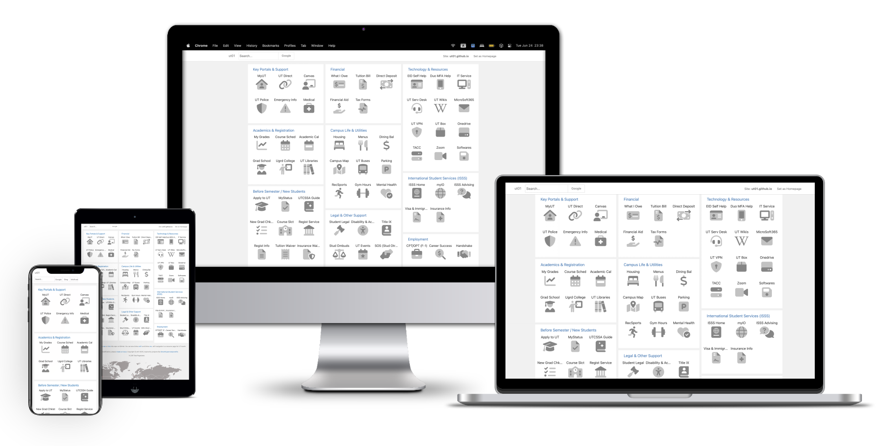
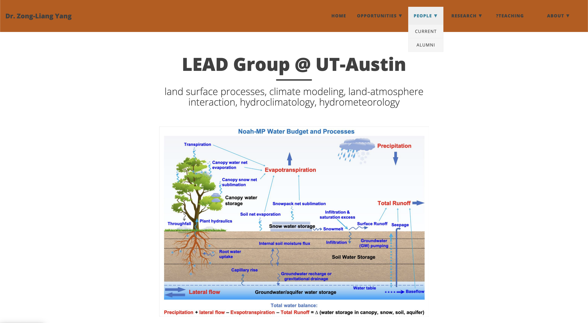
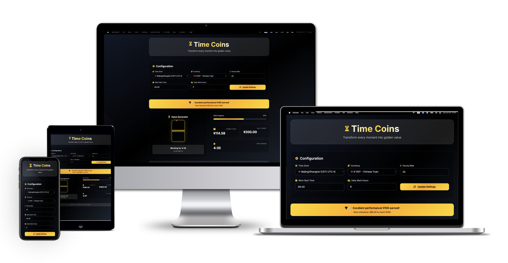

# Web 作品集 - 前端开发与交互设计

专注于学术资源网站、交互式应用和创意项目的前端开发能力展示。

## 技术能力

**前端开发**: HTML5/CSS3响应式设计，JavaScript交互功能，GitHub Pages部署

**用户体验**: 学术资源导航设计，信息架构优化，移动端适配

**创意开发**: 交互动画，时间可视化，个人主页设计

## 学术资源网站

### ut01.github.io

**[ut01.github.io](https://github.com/ut01/ut01.github.io)** - UT-Austin学生导航与资源页面

**ut01** 是我开发的德克萨斯大学奥斯汀分校学生导航平台，解决了学生访问分散的大学服务时面临的深层链接导航和频繁登录超时问题。

通过整合所有核心学术、财务、校园生活服务到单一界面，消除了用户在复杂网站层级中的导航困扰。

**技术栈**: Jekyll, HTML/CSS/JavaScript, GitHub Pages。采用Jekyll静态站点生成器和响应式设计，实现快速加载和跨设备兼容。

**关键策略**: 信息架构优化, 用户体验集中化, 静态站点部署

**主题**: 网页导航, 资源整合, 学生服务

### **[立即访问网站：](https://ut01.github.io)**

站点访问量统计：

### LEAD-UTexas.github.io

**[LEAD-UTexas.github.io](https://github.com/ktwu01/LEAD-UTexas.github.io)** - LEAD-UTexas研究组主页

德克萨斯大学LEAD研究组官方网站，展示研究成果和团队信息。

**技术栈**: HTML, CSS, JavaScript  
**主题**: 研究组织, 学术展示, 团队主页

### **[立即访问网站：](https://LEAD-UTexas.github.io)**

## 交互式应用

### 一寸光阴一寸金 （time-coins）

### **[立即点击网站，让每一刻都闪闪金光](https://ktwu01.github.io/time-coins/)**

实时收入追踪工具，通过精美沙漏动画和金币粒子效果可视化工作收入。解决自由职业者时间价值感知问题，采用渐进式里程碑系统维持工作动力。支持50+时区和33种货币的国际化设计，JavaScript架构确保最佳性能。

**技术栈**: HTML5, CSS3, JavaScript ES6+, Tailwind CSS  
**主题**: 实时数据可视化, 交互动画, 国际化开发

## 创意项目

### komo520

**[komo520](https://github.com/ktwu01/komo520)** - Koko & Momo的爱情宇宙

个性化主页设计，展示创意表达和情感化交互设计能力。

**技术栈**: HTML, CSS, JavaScript  
**主题**: 个人主页, 创意设计, 情感交互

## 核心特性

**响应式设计**: 移动端和桌面端优化的用户界面
**信息架构**: 学术资源的逻辑组织和导航设计
**交互体验**: JavaScript动效和用户交互优化
**部署管理**: GitHub Pages自动化部署和域名配置

## 相关作品集

- **[Python 作品集](../python/)** - 数据分析与科学计算
- **[MATLAB 作品集](../matlab/)** - 信号处理与建模
- **[HPC 作品集](../hpc/)** - 高性能计算
- **[Shell 作品集](../shell/)** - 跨平台Shell配置优化
- **[学术指南](../academic/)** - 研究资源与资助指南

## 持续学习

目前正在扩展React框架、数据可视化库和现代CSS框架技能。

---

**动态项目列表**: [查看我的所有HTML项目](https://github.com/ktwu01?tab=repositories&q=&type=&language=html&sort=)

---

*最后更新: 2025年6月*