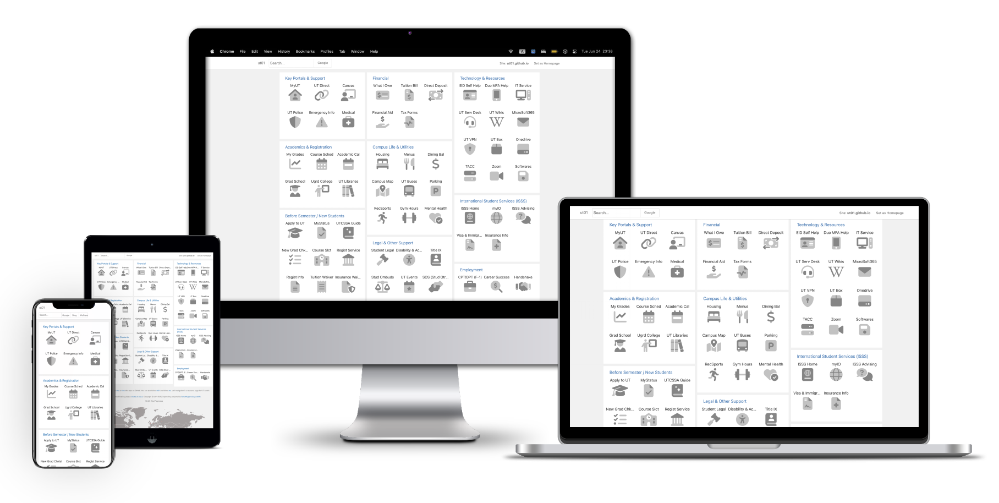
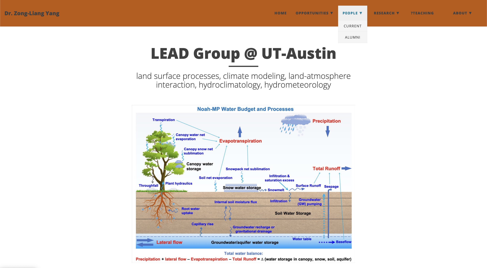
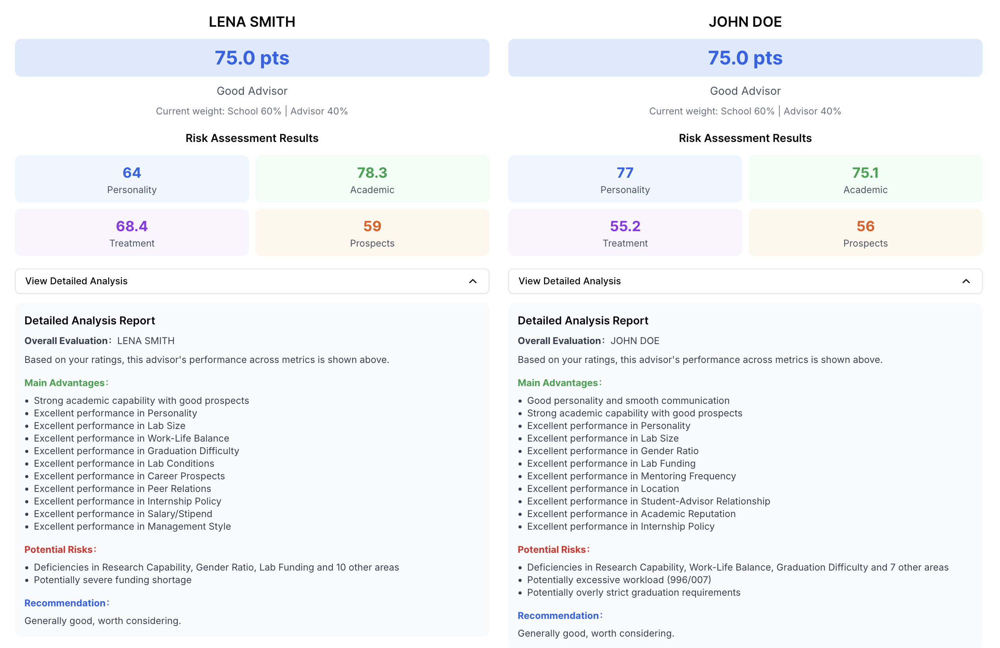

# Web Portfolio - Frontend Development & Interactive Design

Focused on academic resource websites, interactive applications, and creative projects showcasing frontend development capabilities.

## Technical Capabilities

**Frontend Development**: HTML5/CSS3 responsive design, JavaScript interactive features, GitHub Pages deployment

**User Experience**: Academic resource navigation design, information architecture optimization, mobile responsiveness

**Creative Development**: Interactive animations, time visualization, personal homepage design

## Academic Resource Websites

### ut01.github.io

    

**ut01** is a Navigation & Resource platform I developed for UT Austin students.

By consolidating all core academic, financial, and campus life services into a unified interface, the platform eliminates user frustration with complex website hierarchies.

**Tech Stack**: Jekyll, HTML/CSS/JavaScript, GitHub Pages. Built with Jekyll static site generator and responsive design principles to achieve fast loading and cross-device compatibility.

**Key Strategy**: Information architecture optimization, user experience centralization, static site deployment

**Focus Areas**: Web navigation, resource integration, student services

### **[Live Demo：](https://ut01.github.io)**

Site Traffic Analytics: 

### LEAD-UTexas.github.io

**[LEAD-UTexas.github.io](https://github.com/ktwu01/LEAD-UTexas.github.io)** - LEAD-UTexas Research Group Homepage

Official website for the Dr. Zong-Liang Yang’s Land Environment and Atmospheric Dynamics (LEAD) Research Group at University of Texas, showcasing research achievements and team information.

**Tech Stack**: HTML, CSS, JavaScript  
**Topics**: Research organization, academic showcase, team homepage

### **[Live Demo：](https://LEAD-UTexas.github.io)**

## Interactive Applications

### Is This Advisor a Trap? Calculator Version

   

    

### **[Live Demo：](https://advisor-calculator.onrender.com/)**

Scientifically compare multiple advisors to help you avoid problematic supervisors.

**🔍 20-Dimension Evaluation System** : Personality Assessment,  Academic Capability,  Work Environment, Career Development, Smart Weight System, etc.

**Frontend Technology Stack**
- **Framework**: Next.js 15 + TypeScript
- **UI Library**: shadcn/ui (Radix UI + Tailwind CSS)
- **Icons**: Lucide React
- **Styling**: Tailwind CSS
- **Components**: Collapsible panels, tooltips, etc.

### Time Coins - Real-time Earnings Tracker

### **[Experience Live Demo - Make Every Moment Golden](https://ktwu01.github.io/time-coins/)**

A tool that tracks your earnings in real-time with an elegant hourglass animation and falling gold coin effects. It helps freelancers and remote workers visualize their time's value, using a milestone system to keep them motivated.

- **Internationalized:** Supports 50+ time zones and 33 currencies.
- **Two Versions:** Available in both a lightweight static HTML/JS version and a modern Vue 3 + Vite component-based version.
- **Responsive Design:** Styled with Tailwind CSS for a seamless experience on any device.

**Tech Stack:** HTML5, CSS3, JavaScript (ES6+), Vue 3, Vite, Tailwind CSS  
**Key Features:** Real-time data visualization, interactive animations, internationalization.

---

## Creative Projects

### komo520

**[komo520](https://github.com/ktwu01/komo520)** - Koko & Momo's Love Universe

Personalized homepage design showcasing creative expression and emotional interactive design capabilities.

**Tech Stack**: HTML, CSS, JavaScript  
**Topics**: Personal homepage, creative design, emotional interaction

## Core Features

**Responsive Design**: Mobile and desktop optimized user interfaces
**Information Architecture**: Logical organization and navigation design for academic resources
**Interactive Experience**: JavaScript animations and user interaction optimization
**Deployment Management**: Automated GitHub Pages deployment and domain configuration

## Related Portfolios

- **[Python Portfolio](../python/)** - Data Analysis & Scientific Computing
- **[MATLAB Portfolio](../matlab/)** - Signal Processing & Modeling
<!-- - **[HPC Portfolio](../hpc/)** - High Performance Computing -->
- **[Shell Portfolio](../shell/)** -  Cross-platform configuration optimization
- **[Academic Guide](../academic/)** - Research Resources & Funding Guide

## Continuous Learning

Currently expanding skills in React framework, data visualization libraries, and modern CSS frameworks.

---

**Dynamic Project List**:
- [View All My HTML/CSS/SCSS/JavaScript Projects](https://github.com/ktwu01?tab=repositories&language=html)
- [View All My Projects with React](https://github.com/ktwu01?tab=repositories&q=topic%3Areact&type=&language=&sort=)
- [View All My Projects with Vue.js](https://github.com/ktwu01?tab=repositories&q=topic%3Avuejs&type=&language=&sort=)
- [View All My Projects with Next.js](https://github.com/ktwu01?tab=repositories&q=topic%3Anextjs&type=&language=&sort=)
 
---

*Last Updated: July 2025*

<!-- FOLDER-REPOSITORIES:START -->
## Repository Index
Generated: 2026-05-28 UTC. Web, frontend, dashboard, site, and browser-facing repositories. Sorted by newest activity.
| Repository | Activity | Language | Stars |
|------------|----------|----------|------:|
| [earth-space-ai/Earth-Space-ai-homepage](https://github.com/earth-space-ai/Earth-Space-ai-homepage) | 2026-05-28 | CSS | 1 |
| [ktwu01/ktwu01.github.io](https://github.com/ktwu01/ktwu01.github.io) | 2026-05-28 | HTML | 3 |
| [ktwu01/1AI-polish](https://github.com/ktwu01/1AI-polish) | 2026-05-19 | Python | 2 |
| [ktwu01/sean-xiang-chronicle](https://github.com/ktwu01/sean-xiang-chronicle) | 2026-05-14 | HTML | 7 |
| [ktwu01/yang-zhenning-wealth-figures](https://github.com/ktwu01/yang-zhenning-wealth-figures) | 2026-05-14 | HTML | 0 |
| [ktwu01/crypto-dashboard](https://github.com/ktwu01/crypto-dashboard) | 2026-05-08 | TypeScript | 18 |
| [ScienceIntelligence/ResearchSkills](https://github.com/ScienceIntelligence/ResearchSkills) | 2026-05-04 | JavaScript | 36 |
| [ktwu01/summer-calculator](https://github.com/ktwu01/summer-calculator) | 2026-04-10 | JavaScript | 2 |
| [ktwu01/komo520](https://github.com/ktwu01/komo520) | 2026-04-10 | JavaScript | 3 |
| [ktwu01/komomood](https://github.com/ktwu01/komomood) | 2026-03-30 | JavaScript | 2 |
| [ktwu01/ideas-shop](https://github.com/ktwu01/ideas-shop) | 2026-03-21 | TypeScript | 2 |
| [ktwugoat/komo-chronicle](https://github.com/ktwugoat/komo-chronicle) | 2026-03-20 | HTML | 2 |
| [ktwu01/ai-billion-career](https://github.com/ktwu01/ai-billion-career) | 2026-03-18 | TypeScript | 2 |
| [LEAD-UTexas/LEAD-UTexas.github.io](https://github.com/LEAD-UTexas/LEAD-UTexas.github.io) | 2026-01-19 | HTML | 3 |
| [ktwu01/MoSequence26Jan](https://github.com/ktwu01/MoSequence26Jan) | 2026-01-04 | HTML | 0 |
| [ktwu01/neural-galaxy](https://github.com/ktwu01/neural-galaxy) | 2025-11-28 | JavaScript | 3 |
| [ktwu01/school-evaluator](https://github.com/ktwu01/school-evaluator) | 2025-11-14 | TypeScript | 2 |
| [ktwu01/ZuoGuoHuaDiao](https://github.com/ktwu01/ZuoGuoHuaDiao) | 2025-11-14 | JavaScript | 3 |
| [ktwu01/advisor-calculator](https://github.com/ktwu01/advisor-calculator) | 2025-11-14 | TypeScript | 3 |
| [ktwu01/VerificationSuccess](https://github.com/ktwu01/VerificationSuccess) | 2025-11-13 | HTML | 2 |
| [ktwu01/time-coins](https://github.com/ktwu01/time-coins) | 2025-07-23 | JavaScript | 3 |
| [ktwu01/GMZR](https://github.com/ktwu01/GMZR) | 2025-07-18 | JavaScript | 1 |
| [ktwu01/academicpages.github.io](https://github.com/ktwu01/academicpages.github.io) | 2025-05-14 | HTML | 3 |
| [ktwu01/USTC-resource-links](https://github.com/ktwu01/USTC-resource-links) | 2025-04-28 | - | 3 |
| [ktwu01/perler-beads](https://github.com/ktwu01/perler-beads) | 2025-04-25 | TypeScript | 19 |
<!-- FOLDER-REPOSITORIES:END -->
